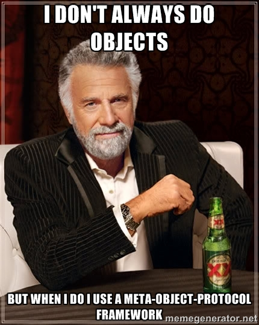

volan
=====

[](https://drone.io/github.com/mvhenten/volan/latest)

Meta classes and typechecks in ~100 lines of code for ES5

Volan adds a wrapper around simple javascript function constructor, providing type-checks
for javascript's native objects and more.

It does so by converting object properties to es5 *getters* and *setters*. It's very similar
to typescript's interfaces but with runtime type checking. It implements a simple
[Meta Object Protocol](https://en.wikipedia.org/wiki/Metaobject), much inspired by the
[Moose Object System for Perl](http://moose.iinteractive.com/en/).

## Install

```bash
    npm install volan --save
```

## Example

```javascript
    var Volan = require('volan');

    var Point = Volan.create({
        x: Number,

        y: Number,

        get xy(){
            return [this.x, this.y];
        }
    });

    var Circle = Volan.create({
        center: Point,

        radius: Number

        get circumference() {
            return (2 * this.radius) * Math.PI;
        },

        pointInCircle: function( point ) {
            var dx = point.x - this.center.x,
                dy = point.y - this.center.y;

            return (Math.sqrt(dx) - Math.sqrt(dy)) < Math.sqrt(this.radius);
        }
    });

    var c = new Circle({
        center: new Point({ x: 10, y: 10 }),
        radius: 12
    });

    // now let em' bounce...
```

## Custom types, methods and static properties

Volan tries to stick with what you know about javascript. The above example for circle show
how a simple method is implemented, together with a simple `get`.

### Methods

Methods are just like native methods: properties of an object. Except, Volan makes them *read-only*
and thus protects them form being overwritten accidentally:

```javascript
    'use strict';

    var Person = Volan.create({
        firstName: String,
        lastName: String,

        greet: function( salutation ){
            return util.format('%s, %s %s', salutation, this.firstName, this.lastName );
        }
    });

    var me = new Person({ firstName: 'Matthijs', lastName: 'van Henten' });

    me.greet('Howdy'); // Howdy, Matthijs van Henten

    me.greet = 'Ooops, forgot your name?'; // throws in strict mode

```

### Static properties or *class constants*

Native `get` and `set` syntax is untouched.
By default, `Object.defineProperty` defines a *read-only* property:

```javascript
    'use strict';

    var x = {};
    Object.defineProperty(x, 'one', { value: 1});

    x.one = 2; // throws an error in strict mode
    console.log( x.one ); // x is still 1

```

When creating a property with a `scalar` or `function` value, Volan follows the same convention:

```javascript
    'use strict';

    var Foo = Volan.create({
        one: 1
    });

    var x = new Foo();
    x.one = 2; // error in strict mode
    console.log( x.one ); // x is still 1
```

### Typechecking

Volan performs typechecking both during object creation and when setting properties that
are *writable*. Properties are *writable* and *required* by default.

This behaviour can be overriden with a little extra syntax.

```javascript
    'use strict';

    var p = new Point();
    // throws: TypeError: Validation failed for "x", value "undefined" is not a Number

    var MagicPoint = Volan.create({
        x: {
            type: Number,
            value: 42,
            writable: false,
            required: false
        },

        y: {
            type: Number,
            value: 42,
            writable: false,
            required: false
        }
    });

    var p = new MagicPoint();

    console.log( p.x, p.y ); // 42, 42

    p.x = 10;

    // OUCH: TypeError: Cannot assign to read only property 'x' of #<Object>
```

#### Native type checks

Volan supports built-in type checks for `Boolean|Number|String|RegExp|Array|Object|Date` and
a special case for pre-compiled regexes:

```javascript
    'use strict';

    var Thing = Volan.create({
        int: new RegEx(/\d+/)
    });

    var t = new Thing({ int: '1' }); // all right
    var p = new Thing({ int: '1,2' }); // throws an error
```

When providing a *class-like* function, typecheck is done by `instanceof` comparison:

```javascript

    // Point is a previously defined function that has a prototype

    var Rect = Volan.create({
        pos: Point,

        width: Number,

        height: Number,
    });

    var r = new Rect({ pos: 1, width: 10, height: 10 });
    // throws: TypeError: Validation failed for "pos", value "1" is not a ... (function dump)

    var s = new Rect({ pos: new Point({ x: 1, y: 2 }), width: 10, height: 10 }); // okidoki

```

#### Custom typechecks

Volan supports custom typechecks by *convention*. To distinguish *Class-like* objects and *methods*
from typechecks, it is required to provide a named function:

```javascript
    'use strict';

    var Walk = Volan.create({
        silly: function SillyWalk(val){
            return /silly/.test(val);
        }
    });

    var d = new Walk({ silly: 'In the park' });
    // throws: TypeError: Validation failed for "silly", value "In the park" is not a SillyWalk

    var p = new Walk({ silly: 'A silly walk in the park' }); // all ok

```

A composite typecheck may be written as such:

```javascript
    'use strict';

    var enum = function( size, type ){
        return EnumTypeCheck(val){
            return val instanceof Array &&
                val.length === size &&
                val.every(function(item){
                    return item instanceof type;
                });
        }
    };

    var Polygon = Volan.create({
        points: enum(3, Point )
    });

```

### Inheritance

Glad you've asked!

Woperting classes are just plain javascript `Function` constructors with a `prototype`.
This means they can be extended like any other, and vice versa. As a bonus, the `super` constructor
is called just before the object is fully initialized.

Examples:

```javascript
    'use strict';

    // back to the classic example...
    var Point = Volan.create({
        x: Number,

        y: Number,

        get xy(){
            return [this.x, this.y];
        }
    });

    // using classic extend...
    $.extend( Point.prototype, {
        move: function(x,y){
            this.x = x;
            this.y = y;
        }
    });

    // adding an alternative constructor
    Point.create = function( x, y ){
        return new Point({ x: x, y: y });
    };

    // extending Volan.extend
    var Point3D = Volan.extend(Point, {
        z: Number,

        get xyz(){
            return [this.x, this.y, this.z];
        }
    });

```

Here's an (contrived) example use case for extending non-volan classes:

```javascript

    var Email = function(){}

    Email.prototype = {
        subject: 'Hello',

        send: function( to ){
            // some logic for sending...
            return this.subject + ' send email to: ' + to;
        }
    };

    var EmailChild = Volan.extend( Email, {
        subject: String,

        to: new RegExp(/.+@.+/), // really lame check for email

        send: function(){
            // need to call super's prototype.send as a method of our own
            return this.__super.prototype.send.call( this, this.to );
        }
    });

    var m = new EmailChild({
        to: 'someone@example.com',
        subject: 'Your new class'
    });

    assert.equal( m.send(), 'Your new class send email to: someone@example.com' );

```

### Isn't this the same as that other project?

I've written similar libraries in the past, called `class-wolperting` and `jackalope`. I've
abandoned jackalope in favour of native javascript syntax and the use of `Object.create`.

`class-wolperting` has been used in production during my time at a company called Whatser.
Volan is a rewrite using less dependencies and sacrificing a couple of features I never used
in real life. It's also a lot smaller, easier to read and maintain and does not rely on `lodash`.

Both projects have an almost similar test suite for similar functionality - in fact this library
was written entirely TDD style using Woleperting's set of tests.

I intend to use this in client-side projects where *size does matter*.

### What's a `volan`, `wolperting` and a `jackalope`

They're mythical creatures inhibiting some unnatural properties, like flying fish and
carnivourus rabbits.

Javascript has a long-standing issue with `prototypical inheritance` v.s. `classical inheritance`.

Some may argue that we should abandon the `prototype` approach altogether, whereas others tend
to keep it more functional. In some use cases, using something `class-like` just fits the bill.

Prototypes have a lower memory footprint then vanilla objects, and function constructors can
be type-checked using `instanceof`.

Lot's of client-side frameworks tend to "extend this" and "extend that", creating a spaghetti
of inheritance and interdependency. Using a formal class system with typechecking at least helps
with bookkeeping.


